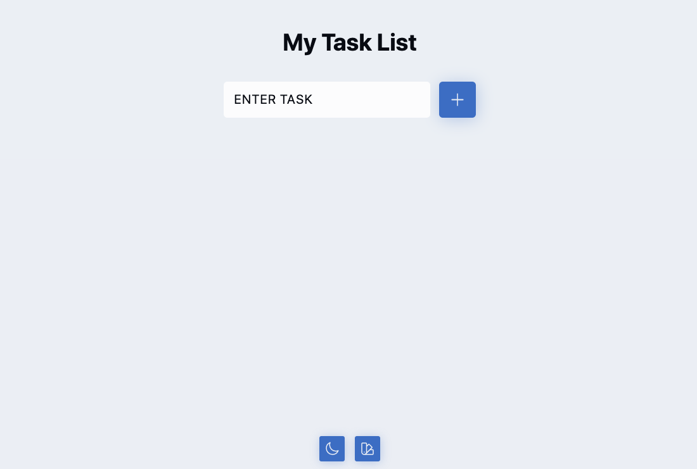
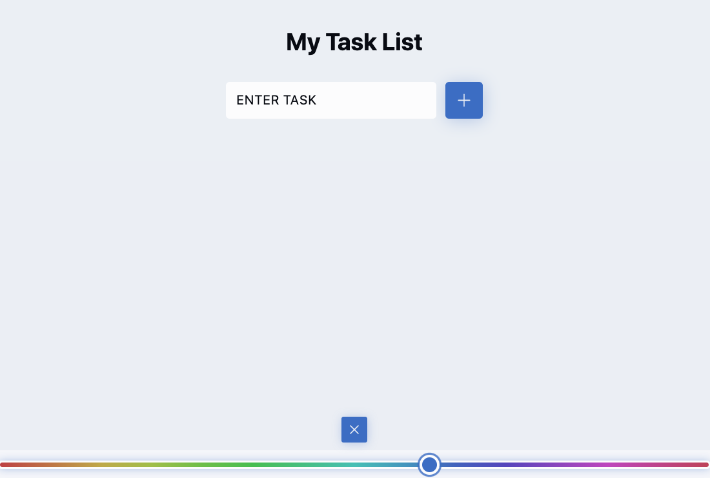
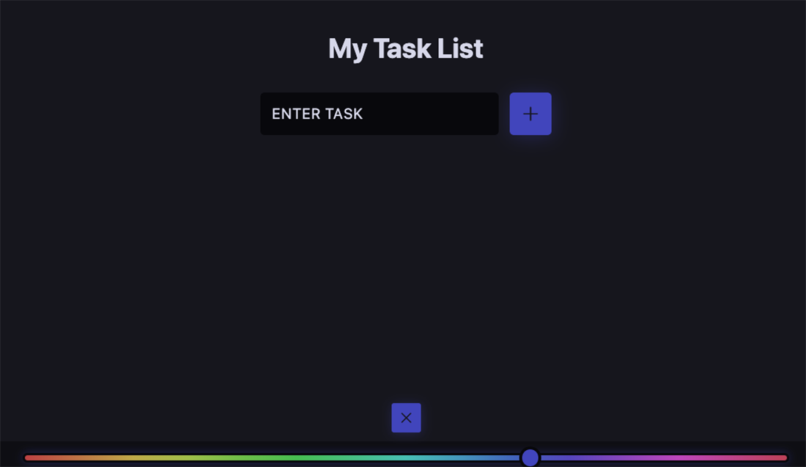
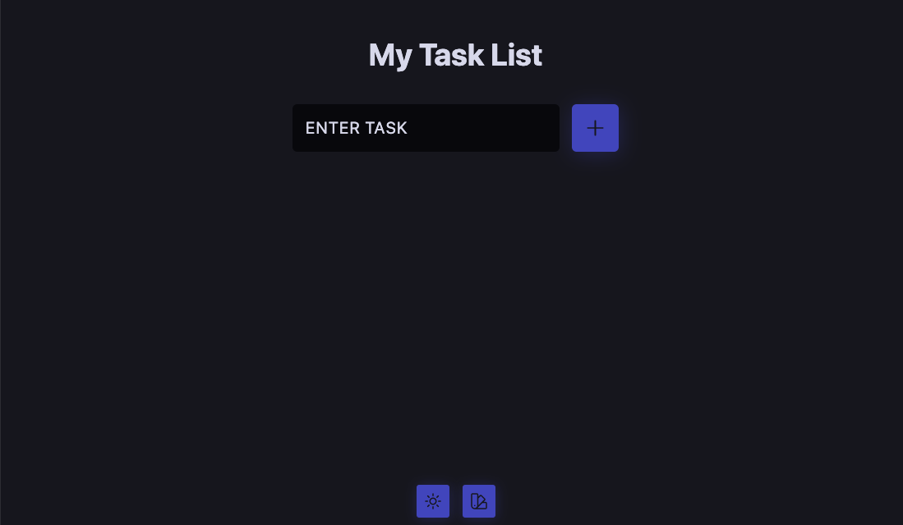

# ToDo-App-React

ToDo App with created with React and Vite. Features dark mode as well as light mode. Includes a slider to adjust secondary colour.

 
<!-- Technologies used -->

 
  <h2 align="left">🛠 Languages and Tools:</h2>
   
  

    

    

    
  

 

<!-- Online link -->

 
<h2 align="left">👀 View online:</h2>
 
<a href="https://todo-app-vinay.netlify.app/" target="_blank" rel="noreferrer">
Deployment Link</a>

 
 

## 📸 Screenshots

<table>
  <tr>
    <td align="center">
      

        
         Light Mode - Feed
      

    </td>
    <td align="center">
      

        
         Light Mode - Modal
      

    </td>
  </tr>
  <tr>
    <td align="center">
      

        
         Dark Mode - Modal
      

    </td>
    <td align="center">
      

        
         Dark Mode - Feed
      

    </td>
  </tr>
</table>
